# Sentinel PRIME V2: An Autonomous, Multi-Regime Options Trading System

  

**Sentinel PRIME** is a professional-grade, fully autonomous, intraday options-buying system designed for the Indian equity indices (NIFTY & BANKNIFTY). It is not a simple script, but a complete, stateful, and resilient trading application built with a focus on architectural stability and sophisticated, multi-layered risk management.

This project was developed as a deep dive into the practical challenges of building mission-critical, real-time financial systems, solving complex issues including concurrency deadlocks, low-level data handling crashes, and state corruption.

---

## 1. System Architecture: The "Planner-Trigger" Model

The system's architecture is designed to solve the classic trade-off between analytical complexity and low-latency execution. It employs a decoupled **Producer-Consumer ("Planner-Trigger")** pattern to ensure stability and responsiveness. This design decouples heavy thinking from fast acting, virtually eliminating the risk of concurrency deadlocks and ensuring the system remains responsive under high load.

```mermaid
%%{init: {'theme': 'dark', 'themeVariables': { 'primaryColor': '#1a1a1a', 'primaryTextColor': '#e6e6e6', 'lineColor': '#8f8f8f', 'secondaryColor': '#2a2a2a'}}}%%
graph TD
    subgraph "Real-Time Data Plane"
        A[KiteTicker WebSocket] -->|Live Ticks| B(PriceBus);
        B -->|Ticks| C{TickProcessor Thread};
        C -->|1-Min Bar Close| D((on_new_bar));
    end

    subgraph "Strategic Planning Plane (Every 60s)"
        E[Scheduler] -->|Triggers| F(run_strategic_planner);
        F -->|Analyzes Data| G[RegimeClassifier];
        G -->|Sets Context| H{{Engine State}};
    end
    
    subgraph "Execution & State Plane"
        D -- Reads --> H;
        D -->|Signal Found| I{Strategy.evaluate};
        I -->|Trade Params| J[risk_ok];
        J -- Approved --> K(Trader);
        K -->|Places/Manages Order| L[Kite Connect REST API];
        L -->|Order Updates| A;
        M[SQLite DB] <--> K;
    end

    subgraph "Observability Plane"
        H -- Reports --> N[Prometheus Metrics];
        K -- Reports --> N;
        A -- Reports --> N;
        D -. Alerts .-> O[Telegram];
        K -. Alerts .-> O;
    end

    style A fill:#0077c8,stroke:#fff,stroke-width:2px
    style L fill:#0077c8,stroke:#fff,stroke-width:2px
    style B fill:#3c3c3c,stroke:#ccc
    style C fill:#3c3c3c,stroke:#ccc
    style E fill:#3c3c3c,stroke:#ccc
    style F fill:#3c3c3c,stroke:#ccc
    style D fill:#e65100,stroke:#ff9800,stroke-width:3px,color:#fff
    style I fill:#4caf50,stroke:#fff
    style J fill:#f44336,stroke:#fff
    style K fill:#9c27b0,stroke:#fff
    style G fill:#2196f3,stroke:#fff
    style M fill:#795548,stroke:#fff
    style H fill:#ffc107,stroke:#000,color:#000
    style N fill:#e6522c,stroke:#fff
    style O fill:#229ed9,stroke:#fff
```

*   **The Planner (`run_strategic_planner`):** A lower-priority, scheduled task that runs every 60 seconds. It performs all computationally expensive work: regime classification, multi-index analysis, and strategy selection, setting a single, clear strategic context (`active_token` and `active_strategy`).
*   **The Trigger (`on_new_bar`):** A high-priority, real-time function that fires instantly on every 1-minute bar close. It is extremely fast, reading the pre-computed plan and performing a final, lightweight tactical signal check before execution.

## 2. Key Features

### A. Adaptive Strategy Framework
The system does not rely on a single strategy. It uses a master `RegimeClassifier` to deploy the right tool for the job based on real-time market conditions.

| Market Regime | Strategy Deployed | Description |
| :--- | :--- | :--- |
| **`TRENDING_UP / DOWN`** | `TrendPullbackStrategy` | Enters on low-risk pullbacks to a key EMA during a confirmed, multi-timeframe trend. |
| **`COMPRESSION`** | `MomentumBreakoutStrategy`| Identifies periods of low volatility (Bollinger Band "squeeze") and enters on high-volume breakouts. |
| **`CHOP`** | `MeanReversionStrategy` | Buys on closes below the lower Bollinger Band and sells on closes above, aiming for a reversion to the mean. |

### B. Institutional-Grade Risk Management
Risk control is the foundational pillar of this system, managed through multiple, automated layers.

*   **Dynamic Position Sizing:** A sophisticated function that calculates trade size based on a blend of four factors:
    1.  **Account Performance:** Uses a `performance_score` to switch between `defensive`, `standard`, and `aggressive` risk tiers.
    2.  **Market Volatility:** Adjusts risk based on the current `VIX` level.
    3.  **Instrument Volatility:** Normalizes position size based on the underlying's `ATR`.
    4.  **Losing Streaks:** Automatically reduces a `risk_factor` after consecutive losses to force a cool-down period.

*   **Hard Circuit Breakers:** The system enforces non-negotiable drawdown limits:
    *   **Daily Drawdown:** A hard stop at a configurable % of the daily high-water mark, which automatically liquidates all positions and halts trading for the day.
    *   **Weekly Drawdown:** A soft stop which forces the system into the `defensive` risk tier for the remainder of the week.

### C. Production-Grade Reliability & Safety
The system is engineered to handle real-world failures gracefully.

*   **Atomic State Persistence:** Uses a "Persist Then Act" pattern with an SQLite database to prevent "ghost orders" in the event of a crash.
*   **Startup Integrity Check:** Validates the database is readable and writeable on startup to prevent catastrophic failures like the incorrect liquidation of a live portfolio.
*   **Graceful Shutdown:** Intercepts `Ctrl+C` signals to ensure all open positions are safely closed before the application exits.
*   **Live Reconciliation:** A scheduled task periodically compares the bot's internal state with the broker's and will automatically flatten any "rogue" positions found.
*   **Hardened Data Flow:** Includes a "Data Sanitization Firewall" to prevent low-level interpreter crashes and a "Stale Feed Check" to halt trading if market data is not being received.

### D. Observability
The bot integrates a lightweight **Prometheus metrics server** (via Flask + Waitress) that exposes critical real-time health and performance indicators, including:
*   Realized & Unrealized P&L
*   Current Daily Drawdown (%)
*   WebSocket Connection Status
*   Live Market Data Feed Age (seconds)
*   Trading Halted Status

This allows for professional, quantitative monitoring via a Grafana dashboard.

## 3. Technology Stack

*   **Language:** Python 3.9+
*   **Core Libraries:** Pandas, NumPy, Pandas TA
*   **API / Broker:** Zerodha Kite Connect API (REST + WebSocket)
*   **Persistence:** SQLite
*   **Observability:** Prometheus, Flask, Waitress
*   **Concurrency:** Python `threading` module (with `RLock` for deadlock prevention)

## 4. Performance

_[This is where you will insert your results after the live paper-trading trial.]_

**Example:**

> The system was run in a live paper-trading environment from **[Start Date]** to **[End Date]**. The performance during this period was as follows:
>
> *   **Net Return:** +11.2%
> *   **Profit Factor:** 1.82
> *   **Win Rate:** 46%
> *   **Average R:R:** 1 : 2.1
> *   **Max Drawdown:** -3.5%
>
> A full, detailed performance report PDF is available upon request.

---

*This project is a personal exploration into the construction of robust, autonomous financial systems. It is not financial advice. All trading involves substantial risk.*
